Multivariate State Space Models
===============================

[](https://travis-ci.org/boennecd/mssm) [](https://www.r-pkg.org/badges/version/mssm) [](https://cran.r-project.org/package=mssm)

This package provides methods to estimate models of the form

,\qquad i\in I_t")


")

where  is simple distribution, we observe  periods, and , , , and  are known. What is multivariate is  (though,  can also be multivariate) and this package is written to scale well in the cardinality of . The package uses independent particle filters as suggested by Lin et al. (2005). This particular type of filter can be used in the method suggested by Poyiadjis, Doucet, and Singh (2011). I will show an example of how to use the package through the rest of the document and highlight some implementation details.

The package can be installed from Github e.g., by calling

``` r
devtools::install_github("boennecd/mssm")
```

or from CRAN by calling

``` r
install.packages("mssm")
```

Table of Contents
-----------------

-   [Poisson Example](#poisson-example)
    -   [Log-Likelihood Approximations](#log-likelihood-approximations)
    -   [Parameter Estimation](#parameter-estimation)
    -   [Faster Approximation](#faster-approximation)
    -   [Approximate Observed Information Matrix](#approximate-observed-information-matrix)
-   [Supported Families](#supported-families)
-   [Fast Sum-Kernel Approximation](#fast-sum-kernel-approximation)
-   [Function Definitions](#function-definitions)
-   [References](#references)

Poisson Example
---------------

We simulate data as follows.

``` r
# simulate path of state variables 
set.seed(78727269)
n_periods <- 312L
(F. <- matrix(c(.5, .1, 0, .8), 2L))
```

    ##      [,1] [,2]
    ## [1,]  0.5  0.0
    ## [2,]  0.1  0.8

``` r
(Q <- matrix(c(.5^2, .1, .1, .7^2), 2L))
```

    ##      [,1] [,2]
    ## [1,] 0.25 0.10
    ## [2,] 0.10 0.49

``` r
(Q_0 <- matrix(c(0.333, 0.194, 0.194, 1.46), 2L))
```

    ##       [,1]  [,2]
    ## [1,] 0.333 0.194
    ## [2,] 0.194 1.460

``` r
betas <- cbind(crossprod(chol(Q_0),        rnorm(2L)                      ), 
               crossprod(chol(Q  ), matrix(rnorm((n_periods - 1L) * 2), 2)))
betas <- t(betas)
for(i in 2:nrow(betas))
  betas[i, ] <- betas[i, ] + F. %*% betas[i - 1L, ]
par(mar = c(5, 4, 1, 1))
matplot(betas, lty = 1, type = "l")
```

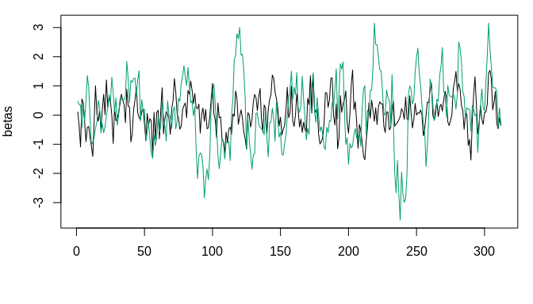

``` r
# simulate observations
cfix <- c(-1, .2, .5, -1) # gamma
n_obs <- 100L
dat <- lapply(1:n_obs, function(id){
  x <- runif(n_periods, -1, 1)
  X <- cbind(X1 = x, X2 = runif(1, -1, 1))
  z <- runif(n_periods, -1, 1)
  
  eta <- drop(cbind(1, X, z) %*% cfix + rowSums(cbind(1, z) * betas))
  y <- rpois(n_periods, lambda = exp(eta))
  
  # randomly drop some
  keep <- .2 > runif(n_periods)
  
  data.frame(y = y, X, Z = z, id = id, time_idx = 1:n_periods)[keep, ]
})
dat <- do.call(rbind, dat)

# show some properties 
nrow(dat)
```

    ## [1] 6242

``` r
head(dat)
```

    ##    y      X1     X2       Z id time_idx
    ## 2  0  0.5685 0.9272  0.9845  1        2
    ## 3  0 -0.2260 0.9272  0.1585  1        3
    ## 4  1 -0.7234 0.9272  0.4847  1        4
    ## 5  1 -0.3010 0.9272 -0.6352  1        5
    ## 8  2 -0.4437 0.9272  0.8311  1        8
    ## 13 1  0.2834 0.9272  0.7135  1       13

``` r
table(dat$y)
```

    ## 
    ##    0    1    2    3    4    5    6    7    8    9   10   11   12   13   14 
    ## 3881 1479  486  180   83   54   32    8    7    6    6    2    3    3    2 
    ##   15   16   17   20   21   24   26   28 
    ##    2    1    1    2    1    1    1    1

``` r
# quick smooth of number of events vs. time
par(mar = c(5, 4, 1, 1))
plot(smooth.spline(dat$time_idx, dat$y), type = "l", xlab = "Time", 
     ylab = "Number of events")
```


``` r
# and split by those with `Z` above and below 0
with(dat, {
  z_large <- ifelse(Z > 0, "large", "small")
  smooths <- lapply(split(cbind(dat, z_large), z_large), function(x){
    plot(smooth.spline(x$time_idx, x$y), type = "l", xlab = "Time", 
     ylab = paste("Number of events -", unique(x$z_large)))
  })
})
```

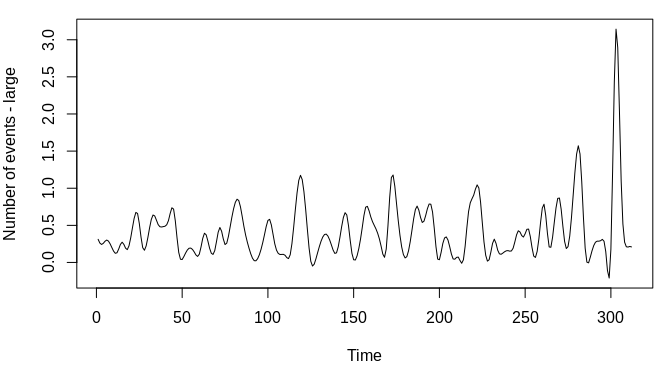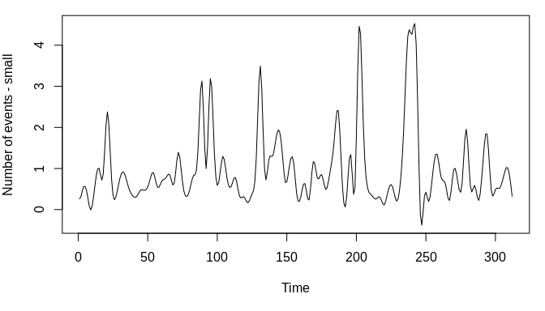

In the above, we simulate 312 (`n_periods`) with 100 (`n_obs`) individuals. Each individual has a fixed covariate, `X2`, and two time-varying covariates, `X1` and `Z`. One of the time-varying covariates, `Z`, has a random slope. Further, the intercept is also random.

### Log-Likelihood Approximations

We start by estimating a generalized linear model without random effects.

``` r
glm_fit <- glm(y ~ X1 + X2 + Z, poisson(), dat)
summary(glm_fit)
```

    ## 
    ## Call:
    ## glm(formula = y ~ X1 + X2 + Z, family = poisson(), data = dat)
    ## 
    ## Deviance Residuals: 
    ##    Min      1Q  Median      3Q     Max  
    ## -2.266  -1.088  -0.767   0.395  10.913  
    ## 
    ## Coefficients:
    ##             Estimate Std. Error z value Pr(>|z|)    
    ## (Intercept)  -0.5558     0.0180  -30.82  < 2e-16 ***
    ## X1            0.2024     0.0265    7.62  2.4e-14 ***
    ## X2            0.5160     0.0275   18.78  < 2e-16 ***
    ## Z            -0.9122     0.0286  -31.90  < 2e-16 ***
    ## ---
    ## Signif. codes:  0 '***' 0.001 '**' 0.01 '*' 0.05 '.' 0.1 ' ' 1
    ## 
    ## (Dispersion parameter for poisson family taken to be 1)
    ## 
    ##     Null deviance: 10989.1  on 6241  degrees of freedom
    ## Residual deviance:  9427.1  on 6238  degrees of freedom
    ## AIC: 14977
    ## 
    ## Number of Fisher Scoring iterations: 6

``` r
logLik(glm_fit)
```

    ## 'log Lik.' -7485 (df=4)

Next, we make a log-likelihood approximation with the implemented particle at the true parameters with the `mssm` function.

``` r
library(mssm)
ll_func <- mssm(
  fixed = y ~ X1 + X2 + Z, family = poisson(), data = dat, 
  # make it explict that there is an intercept (not needed)
  random = ~ 1 + Z, ti = time_idx, control = mssm_control(
    n_threads = 5L, N_part = 500L, what = "log_density"))

system.time(
  mssm_obj <- ll_func$pf_filter(
    cfix = cfix, disp = numeric(), F. = F., Q = Q))
```

    ##    user  system elapsed 
    ##   1.944   0.014   0.494

``` r
# returns the log-likelihood approximation
logLik(mssm_obj)
```

    ## 'log Lik.' -5865 (df=11)

``` r
# also shown by print
mssm_obj
```

    ## 
    ## Call:  mssm(fixed = y ~ X1 + X2 + Z, family = poisson(), data = dat, 
    ##     random = ~1 + Z, ti = time_idx, control = mssm_control(n_threads = 5L, 
    ##         N_part = 500L, what = "log_density"))
    ## 
    ## Family is 'poisson' with link 'log'.
    ## State vector is assumed to be X_t ~ N(F * X_(t-1), Q).
    ## 
    ## F is
    ##             (Intercept)   Z
    ## (Intercept)         0.5 0.0
    ## Z                   0.1 0.8
    ## 
    ## Q's standard deviations are
    ## (Intercept)           Z 
    ##         0.5         0.7 
    ## 
    ## Q's correlation matrix is (lower triangle is shown)
    ##   (Intercept)
    ## Z       0.286
    ## 
    ## Fixed coefficients are
    ## (Intercept)          X1          X2           Z 
    ##        -1.0         0.2         0.5        -1.0 
    ## 
    ## Log-likelihood approximation is -5865
    ## 500 particles are used and summary statistics for effective sample sizes are
    ##   Mean      458.4
    ##   sd         22.1
    ##   Min       325.7
    ##   Max       484.8
    ## 
    ## Number of parameters           11
    ## Number of observations       6242

We get a much larger log-likelihood as expected. We can plot the predicted values of state variables from the filter distribution.

``` r
# get predicted mean and prediction interval 
filter_means <- plot(mssm_obj, do_plot = FALSE)

# plot with which also contains the true paths
for(i in 1:ncol(betas)){
  be <- betas[, i]
  me <- filter_means$means[i, ]
  lb <- filter_means$lbs[i, ]
  ub <- filter_means$ubs[i, ]
  
  #     dashed: true paths
  # continuous: predicted mean from filter distribution 
  #     dotted: prediction interval
  par(mar = c(5, 4, 1, 1))
  matplot(cbind(be, me, lb, ub), lty = c(2, 1, 3, 3), type = "l", 
          col = "black", ylab = rownames(filter_means$lbs)[i])
}
```

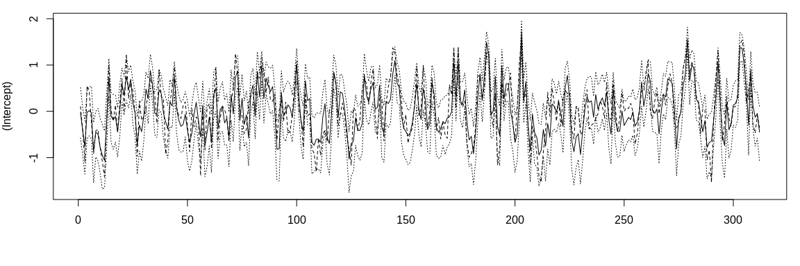

We can also get predicted values from the smoothing distribution.

``` r
# get smoothing weights
mssm_obj <- ll_func$smoother(mssm_obj)

# get predicted mean and prediction interval from smoothing distribution
smooth_means <- plot(mssm_obj, do_plot = FALSE, which_weights = "smooth")

for(i in 1:ncol(betas)){
  be  <- betas[, i]
  me  <- filter_means$means[i, ]
  lb  <- filter_means$lbs[i, ]
  ub  <- filter_means$ubs[i, ]
  mes <- smooth_means$means[i, ]
  lbs <- smooth_means$lbs[i, ]
  ubs <- smooth_means$ubs[i, ]
  
  #     dashed: true paths
  # continuous: predicted mean from filter distribution 
  #     dotted: prediction interval
  # 
  # smooth predictions are in a different color
  par(mar = c(5, 4, 1, 1))
  matplot(cbind(be, me, lb, ub, mes, lbs, ubs), 
          lty = c(2, 1, 3, 3, 1, 3, 3), type = "l", 
          col = c(rep(1, 4), rep(2, 3)), ylab = rownames(filter_means$lbs)[i])
}
```

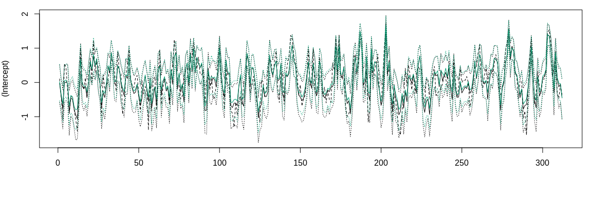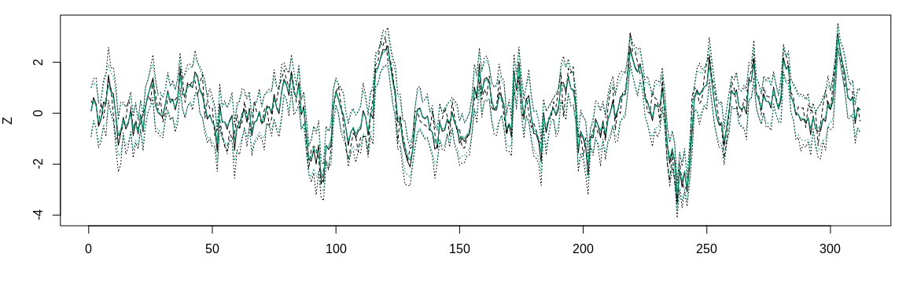

``` r
# compare mean square error of the two means
rbind(filter = colMeans((t(filter_means$means) - betas)^2), 
      smooth = colMeans((t(smooth_means$means) - betas)^2))
```

    ##        (Intercept)      Z
    ## filter      0.1035 0.2127
    ## smooth      0.1012 0.1906

We can get the effective sample size at each point in time with the `get_ess` function.

``` r
(ess <- get_ess(mssm_obj))
```

    ## Effective sample sizes
    ##   Mean      458.4
    ##   sd         22.1
    ##   Min       325.7
    ##   Max       484.8

``` r
plot(ess)
```


We can compare this what we get by using a so-called bootstrap (like) filter instead.

``` r
local({
  ll_boot <- mssm(
    fixed = y ~ X1 + X2 + Z, family = poisson(), data = dat, 
    random = ~ Z, ti = time_idx, control = mssm_control(
      n_threads = 5L, N_part = 500L, what = "log_density", 
      which_sampler = "bootstrap"))
  
  print(system.time(
    boot_fit <- ll_boot$pf_filter(
      cfix = coef(glm_fit), disp = numeric(), F. = F., Q = Q)))
  
  plot(get_ess(boot_fit))
})
```

    ##    user  system elapsed 
    ##   2.268   0.048   0.576

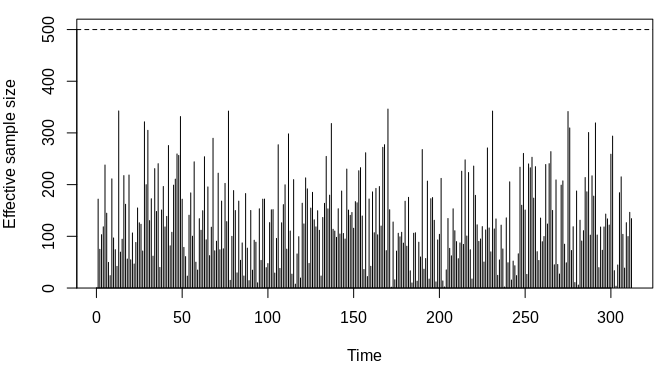

The above is not much faster (and maybe slower in this run) as the bulk of the computation is not in the sampling step. We can also compare the log-likelihood approximation with what we get if we choose parameters close to the GLM estimates.

``` r
mssm_glm <- ll_func$pf_filter(
  cfix = coef(glm_fit), disp = numeric(), F. = diag(1e-8, 2), 
  Q = diag(1e-4^2, 2))
logLik(mssm_glm)
```

    ## 'log Lik.' -7485 (df=11)

### Parameter Estimation

We will need to estimate the parameters for real applications. We could do this e.g., with a Monte Carlo expectation-maximization algorithm or by using a Monte Carlo approximation of the gradient. Currently, the latter is only available and the user will have to write a custom function to perform the estimation. I will provide an example below. The `sgd` function is not a part of the package. Instead the package provides a way to approximate the gradient and allows the user to perform subsequent maximization (e.g., with constraints or penalties). The definition of the `sgd` is given at the end of this file as it is somewhat long. We start by using a Laplace approximation to get the starting values.

``` r
# setup mssmFunc object to use 
ll_func <- mssm(  
  fixed = y ~ X1 + X2 + Z, family = poisson(), data = dat, 
  random = ~ Z, ti = time_idx, control = mssm_control(
    n_threads = 5L, N_part = 200L, what = "gradient"))

# use Laplace approximation to get starting values
system.time(
  sta <- ll_func$Laplace(
    F. = diag(.5, 2), Q = diag(1, 2), cfix = coef(glm_fit), disp = numeric()))
```

    ## Mode approxmation failed at least once

    ##    user  system elapsed 
    ##  27.203   0.536   6.692

``` r
# the function returns an object with the estimated parameters and  
# approximation log-likelihood
sta
```

    ## 
    ## Call:  mssm(fixed = y ~ X1 + X2 + Z, family = poisson(), data = dat, 
    ##     random = ~Z, ti = time_idx, control = mssm_control(n_threads = 5L, 
    ##         N_part = 200L, what = "gradient"))
    ## 
    ## Family is 'poisson' with link 'log'.
    ## Parameters are estimated with a Laplace approximation.
    ## State vector is assumed to be X_t ~ N(F * X_(t-1), Q).
    ## 
    ## F estimate is
    ##             (Intercept)        Z
    ## (Intercept)     0.49174 -0.00466
    ## Z              -0.00831  0.79513
    ## 
    ## Q's standard deviations estimates are
    ## (Intercept)           Z 
    ##       0.547       0.703 
    ## 
    ## Q's correlation matrix estimates is (lower triangle is shown)
    ##   (Intercept)
    ## Z       0.325
    ## 
    ## Fixed coefficients estimates are
    ## (Intercept)          X1          X2           Z 
    ##      -0.910       0.213       0.523      -0.892 
    ## 
    ## Log-likelihood approximation is -5863 
    ## Number of parameters           11
    ## Number of observations       6242

``` r
sta$Q
```

    ##             (Intercept)      Z
    ## (Intercept)      0.2996 0.1251
    ## Z                0.1251 0.4940

<!--
library(knitr)
opts_knit$set(output.dir = ".")
opts_chunk$set(cache.path = paste0(
    file.path("README_cache", "markdown_github"), .Platform$file.sep))
load_cache("sgd")
-->
``` r
# use stochastic gradient descent with averaging
set.seed(25164416)
system.time( 
  res <- sgd(
    ll_func, F. = sta$F., Q = sta$Q, cfix = sta$cfix, 
    lrs = .001 * (1:50)^(-1/2), n_it = 50L, avg_start = 30L))
```

    ##    user  system elapsed 
    ## 212.198   1.331  49.104

``` r
# use Adam algorithm instead
set.seed(25164416)
system.time( 
  resa <- adam(
    ll_func, F. = sta$F., Q = sta$Q, cfix = sta$cfix, 
    lr = .01, n_it = 50L))
```

    ##    user  system elapsed 
    ## 209.052   1.358  48.496

A plot of the approximate log-likelihoods at each iteration is shown below along with the final estimates.

``` r
print(tail(res$logLik), digits = 6) # final log-likelihood approximations
```

    ## [1] -5862.03 -5861.98 -5861.53 -5862.08 -5862.73 -5860.91

``` r
par(mar = c(5, 4, 1, 1))
plot(res$logLik, type = "l", ylab = "log-likelihood approximation")
```

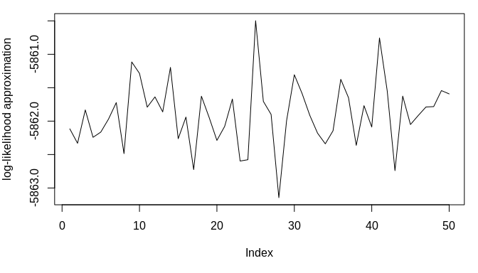

``` r
plot(res$grad_norm, type = "l", ylab = "approximate gradient norm")
```

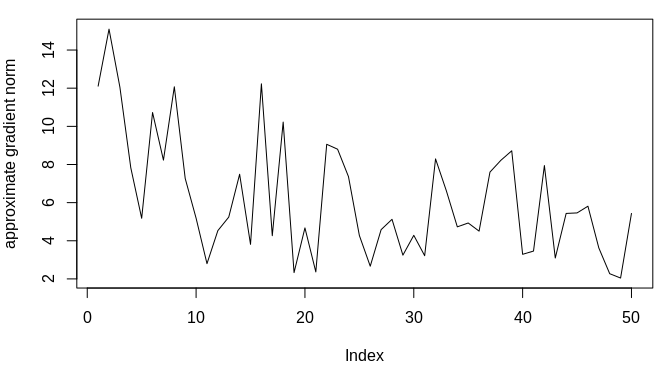

``` r
# final estimates
res$F. 
```

    ##             (Intercept)         Z
    ## (Intercept)    0.496207 -0.002271
    ## Z             -0.001027  0.799034

``` r
res$Q
```

    ##             (Intercept)      Z
    ## (Intercept)      0.3042 0.1248
    ## Z                0.1248 0.4978

``` r
res$cfix
```

    ## [1] -0.9795  0.2139  0.5242 -0.8881

``` r
# compare with output from Adam algorithm
print(tail(resa$logLik), digits = 6) # final log-likelihood approximations
```

    ## [1] -5862.03 -5862.00 -5861.56 -5862.11 -5862.76 -5860.94

``` r
plot(resa$logLik, type = "l", ylab = "log-likelihood approximation")
```

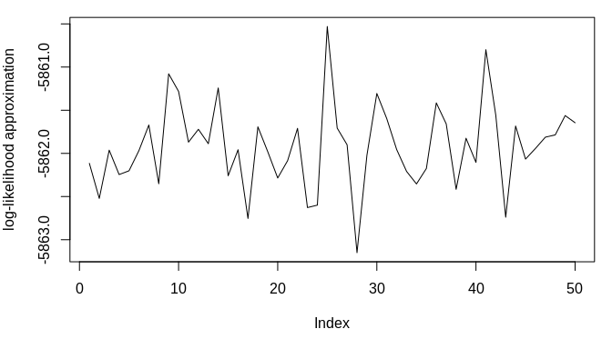

``` r
plot(resa$grad_norm, type = "l", ylab = "approximate gradient norm")
```


``` r
resa$F. 
```

    ##             (Intercept)         Z
    ## (Intercept)    0.499589 -0.003025
    ## Z              0.006927  0.796342

``` r
resa$Q
```

    ##             (Intercept)      Z
    ## (Intercept)      0.3063 0.1275
    ## Z                0.1275 0.4968

``` r
resa$cfix
```

    ## [1] -0.9783  0.2141  0.5221 -0.8868

We may want to use more particles towards the end when we estimate the parameters. To do, we use the approximation described in the next section at the final estimates that we arrived at before.

<!--
library(knitr)
opts_knit$set(output.dir = ".")
opts_chunk$set(cache.path = paste0(
    file.path("README_cache", "markdown_github"), .Platform$file.sep))
load_cache("cont_est")
-->
``` r
ll_func <- mssm(
  fixed = y ~ X1 + X2 + Z, family = poisson(), data = dat, 
  random = ~ Z, ti = time_idx, control = mssm_control(
    n_threads = 5L, N_part = 10000L, what = "gradient",
    which_ll_cp = "KD", aprx_eps = .01))

set.seed(25164416)
system.time( 
  res_final <- adam(
    ll_func, F. = resa$F., Q = resa$Q, cfix = resa$cfix, 
    lr = .001, n_it = 25L))
```

    ##    user  system elapsed 
    ##  2878.9    23.2   634.6

``` r
plot(res_final$logLik, type = "l", ylab = "log-likelihood approximation")
```


``` r
plot(res_final$grad_norm, type = "l", ylab = "approximate gradient norm")
```


``` r
res_final$F. 
```

    ##             (Intercept)         Z
    ## (Intercept)    0.501657 -0.001767
    ## Z              0.005557  0.800387

``` r
res_final$Q
```

    ##             (Intercept)      Z
    ## (Intercept)      0.3041 0.1242
    ## Z                0.1242 0.4966

``` r
res_final$cfix
```

    ## [1] -0.9762  0.2140  0.5248 -0.9030

### Faster Approximation

One drawback with the particle filter we use is that it has ") computational complexity where  is the number of particles. We can see this by changing the number of particles.

``` r
local({
  # assign function that returns a function that uses a given number of 
  # particles
  func <- function(N){
    ll_func <- mssm(
      fixed = y ~ X1 + X2 + Z, family = poisson(), data = dat, 
      random = ~ Z, ti = time_idx, control = mssm_control(
        n_threads = 5L, N_part = N, what = "log_density"))
    function()
      ll_func$pf_filter(
        cfix = coef(glm_fit), disp = numeric(), F. = diag(1e-8, 2), 
        Q = diag(1e-4^2, 2))
      
  }
  
  f_100  <- func( 100L)
  f_200  <- func( 200L)
  f_400  <- func( 400L)
  f_800  <- func( 800L)
  f_1600 <- func(1600L)
  
  # benchmark. Should ĩncrease at ~ N^2 rate
  microbenchmark::microbenchmark(
    `100` = f_100(), `200` = f_200(), `400` = f_400(), `800` = f_800(),
    `1600` = f_1600(), times = 3L)
})
```

    ## Unit: milliseconds
    ##  expr     min      lq    mean  median      uq     max neval
    ##   100   68.88   72.13   75.57   75.37   78.92   82.47     3
    ##   200  129.27  141.90  149.55  154.53  159.69  164.84     3
    ##   400  404.68  412.07  415.49  419.47  420.90  422.32     3
    ##   800 1029.99 1109.39 1149.03 1188.80 1208.55 1228.30     3
    ##  1600 3387.65 3429.32 3457.94 3470.99 3493.08 3515.17     3

A solution is to use the dual k-d tree method I cover later. The computational complexity is ") for this method which is somewhat indicated by the run times shown below.

``` r
local({
  # assign function that returns a function that uses a given number of 
  # particles
  func <- function(N){
    ll_func <- mssm(
      fixed = y ~ X1 + X2 + Z, family = poisson(), data = dat, 
      random = ~ Z, ti = time_idx, control = mssm_control(
        n_threads = 5L, N_part = N, what = "log_density", 
        which_ll_cp = "KD", KD_N_max = 6L, aprx_eps = 1e-2))
    function()
      ll_func$pf_filter(
        cfix = coef(glm_fit), disp = numeric(), F. = diag(1e-8, 2), 
        Q = diag(1e-4^2, 2))
      
  }
  
  f_100   <- func(  100L)
  f_200   <- func(  200L)
  f_400   <- func(  400L)
  f_800   <- func(  800L)
  f_1600  <- func( 1600L)
  f_12800 <- func(12800L) # <-- much larger
  
  # benchmark. Should increase at ~ N log N rate
  microbenchmark::microbenchmark(
    `100` = f_100(), `200` = f_200(), `400` = f_400(), `800` = f_800(), 
    `1600` = f_1600(), `12800` = f_12800(), times = 3L)
})
```

    ## Unit: milliseconds
    ##   expr    min     lq   mean median     uq    max neval
    ##    100  112.1  118.1  123.8  124.1  129.6  135.0     3
    ##    200  205.5  225.7  238.9  245.9  255.6  265.4     3
    ##    400  407.3  418.0  443.3  428.7  461.2  493.8     3
    ##    800  845.1  875.4  898.9  905.7  925.8  945.9     3
    ##   1600 1537.7 1555.8 1571.8 1573.8 1588.8 1603.8     3
    ##  12800 8160.8 8161.0 8269.1 8161.3 8323.3 8485.3     3

The `aprx_eps` controls the size of the error. To be precise about what this value does then we need to some notation for the complete likelihood (the likelihood where we observe s). This is

g_1(\vec y_1 \mid \vec \beta_1)\prod_{t=2}^Tf(\vec\beta_t \mid\vec\beta_{t-1})g_t(y_t\mid\beta_t)")

where  is conditional distribution  given ,  is the conditional distribution of  given , and  is the time-invariant distribution of . Let }") be the weight of particle  at time  and }") be the th particle at time . Then we ensure the error in our evaluation of terms }f(\vec\beta_t^{(i)} \mid \vec\beta_{t-1}^{(j)})") never exceeds

} \frac{u - l}{(u + l)/2}")

 where  and  are respectively an upper and lower bound of } \mid \vec\beta_{t-1}^{(j)})"). The question is how big the error is. Thus, we consider the error in the log-likelihood approximation at the true parameters.

``` r
ll_compare <- local({
  N_use <- 500L 
  # we alter the seed in each run. First, the exact method
  ll_no_approx <- sapply(1:200, function(seed){
    ll_func <- mssm(
      fixed = y ~ X1 + X2 + Z, family = poisson(), data = dat,
      random = ~ Z, ti = time_idx, control = mssm_control(
        n_threads = 5L, N_part = N_use, what = "log_density", 
        seed = seed))
    
    logLik(ll_func$pf_filter(
      cfix = cfix, disp = numeric(), F. = F., Q = Q))
  })
  
  # then the approximation
  ll_approx <- sapply(1:200, function(seed){
    ll_func <- mssm(
      fixed = y ~ X1 + X2 + Z, family = poisson(), data = dat,
      random = ~ Z, ti = time_idx, control = mssm_control(
        n_threads = 5L, N_part = N_use, what = "log_density", 
        KD_N_max = 6L, aprx_eps = 1e-2, seed = seed, 
        which_ll_cp = "KD"))
    
    logLik(ll_func$pf_filter(
      cfix = cfix, disp = numeric(), F. = F., Q = Q))
  })
  
  list(ll_no_approx = ll_no_approx, ll_approx = ll_approx)
})
```

``` r
par(mar = c(5, 4, 1, 1))
hist(
  ll_compare$ll_no_approx, main = "", breaks = 20L, 
  xlab = "Log-likelihood approximation -- no aprox")
```

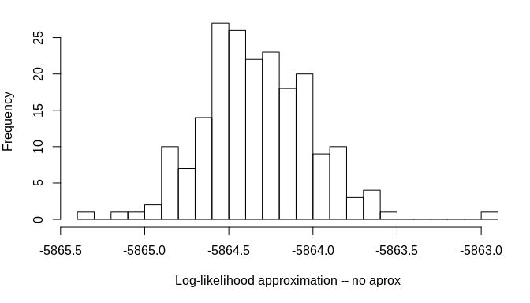

``` r
hist(
  ll_compare$ll_approx   , main = "", breaks = 20L, 
  xlab = "Log-likelihood approximation -- aprox")
```


We can make a t-test for whether there is a difference between the two log-likelihood estimates

``` r
with(ll_compare, t.test(ll_no_approx, ll_approx))
```

    ## 
    ##  Welch Two Sample t-test
    ## 
    ## data:  ll_no_approx and ll_approx
    ## t = -8.9, df = 398, p-value <2e-16
    ## alternative hypothesis: true difference in means is not equal to 0
    ## 95 percent confidence interval:
    ##  -0.5457 -0.3479
    ## sample estimates:
    ## mean of x mean of y 
    ##     -5864     -5864

The fact that there may only be a small difference if any is nice because now we can get a much better approximation (in terms of variance) quickly of e.g., the log-likelihood as shown below.

``` r
ll_approx <- sapply(1:10, function(seed){
  N_use <- 10000L # many more particles
  
  ll_func <- mssm(
    fixed = y ~ X1 + X2 + Z, family = poisson(), data = dat,
    random = ~ Z, ti = time_idx, control = mssm_control(
      n_threads = 5L, N_part = N_use, what = "log_density", 
      KD_N_max = 100L, aprx_eps = 1e-2, seed = seed, 
      which_ll_cp = "KD"))
  
  logLik(ll_func$pf_filter(
    cfix = cfix, disp = numeric(), F. = F., Q = Q))
}) 

# approximate log-likelihood
sd(ll_approx)
```

    ## [1] 0.1091

``` r
print(mean(ll_approx), digits = 6)
```

    ## [1] -5863.97

``` r
# compare sd with 
sd(ll_compare$ll_no_approx)
```

    ## [1] 0.5033

``` r
print(mean(ll_compare$ll_no_approx), digits = 6)
```

    ## [1] -5864.42

### Approximate Observed Information Matrix

Next, we look at approximating the observed information matrix with the method suggested by Poyiadjis, Doucet, and Singh (2011).

<!--
library(knitr)
opts_knit$set(output.dir = ".")
opts_chunk$set(cache.path = paste0(
    file.path("README_cache", "markdown_github"), .Platform$file.sep))
load_cache("apprx_obs_info")
-->
``` r
ll_func <- mssm(
  fixed = y ~ X1 + X2 + Z, family = poisson(), data = dat,
  random = ~ Z, ti = time_idx, control = mssm_control(
    n_threads = 5L, N_part = 10000L, what = "Hessian",
    which_ll_cp = "KD", aprx_eps = .01))

set.seed(46658529)
system.time(
  mssm_obs_info <- ll_func$pf_filter(
    cfix = res_final$cfix, disp = numeric(), F. = res_final$F., 
    Q = res_final$Q))
```

    ##    user  system elapsed 
    ## 327.563   1.297  71.051

We define a function below to get the approximate gradient and approximate observed information matrix from the returned object. Then we compare the output to the GLM we estimated and to the true parameters.

``` r
# Function to subtract the approximate gradient elements and approximate 
# observed information matrix. 
# 
# Args:
#   object: an object of class mssm.
#
# Returns:
#   list with the approximate gradient elements and approximate observed 
# information matrix. 
get_grad_n_obs_info <- function(object){
  stopifnot(inherits(object, "mssm"))

  # get dimension of the components
  n_rng   <- nrow(object$Z)
  dim_fix <- nrow(object$X)
  dim_rng <- n_rng * n_rng + ((n_rng + 1L) * n_rng) / 2L
  has_dispersion <-
    any(sapply(c("^Gamma", "^gaussian"), grepl, x = object$family))
  
  # get quantities for each particle
  quants <-     tail(object$pf_output, 1L)[[1L]]$stats
  ws     <- exp(tail(object$pf_output, 1L)[[1L]]$ws_normalized)

  # get mean estimates
  meas <- colSums(t(quants) * drop(ws))

  # separate out the different components. Start with the gradient
  idx <- dim_fix + dim_rng + has_dispersion
  grad <- meas[1:idx]
  dim_names <- names(grad)

  # then the observed information matrix
  I1 <- matrix(
    meas[-(1:idx)], dim_fix + dim_rng + has_dispersion, 
    dimnames = list(dim_names, dim_names))
  
  I2 <- matrix(0., nrow(I1), ncol(I1))
  for(i in seq_along(ws))
    I2 <- I2 + ws[i] * tcrossprod(quants[1:idx, i])

  list(grad = grad, obs_info = tcrossprod(grad) - I1 - I2)
}

# use function
out <- get_grad_n_obs_info(mssm_obs_info)

# approximate gradient
out$grad
```

    ##               (Intercept)                        X1 
    ##                    0.1857                   -0.3223 
    ##                        X2                         Z 
    ##                   -0.2646                   -0.4061 
    ## F:(Intercept).(Intercept)           F:Z.(Intercept) 
    ##                   -0.0172                   -0.4134 
    ##           F:(Intercept).Z                     F:Z.Z 
    ##                   -0.3479                   -0.4440 
    ## Q:(Intercept).(Intercept)           Q:Z.(Intercept) 
    ##                    0.1637                   -1.2525 
    ##                     Q:Z.Z 
    ##                    0.4210

``` r
# approximate standard errors
(ses <- sqrt(diag(solve(out$obs_info))))
```

    ##               (Intercept)                        X1 
    ##                   0.04356                   0.02815 
    ##                        X2                         Z 
    ##                   0.02920                   0.08821 
    ## F:(Intercept).(Intercept)           F:Z.(Intercept) 
    ##                   0.06735                   0.09064 
    ##           F:(Intercept).Z                     F:Z.Z 
    ##                   0.03282                   0.04166 
    ## Q:(Intercept).(Intercept)           Q:Z.(Intercept) 
    ##                   0.03632                   0.03966 
    ##                     Q:Z.Z 
    ##                   0.07011

``` r
# look at output for parameters in the observational equation. First, compare 
# with glm's standard errors
sqrt(diag(vcov(glm_fit)))
```

    ## (Intercept)          X1          X2           Z 
    ##     0.01803     0.02654     0.02747     0.02860

``` r
# and relative to true parameters vs. estimated
rbind(
  true             = cfix, 
  glm              = coef(glm_fit), 
  mssm             = res_final$cfix, 
  `standard error` = ses[1:4])
```

    ##                (Intercept)      X1     X2        Z
    ## true              -1.00000 0.20000 0.5000 -1.00000
    ## glm               -0.55576 0.20237 0.5160 -0.91216
    ## mssm              -0.97624 0.21398 0.5248 -0.90299
    ## standard error     0.04356 0.02815 0.0292  0.08821

``` r
# next look at parameters in state equation. First four are for F.
rbind(
  true             = c(F.), 
  mssm             = c(res_final$F.), 
  `standard error` = ses[5:8])
```

    ##                F:(Intercept).(Intercept) F:Z.(Intercept) F:(Intercept).Z
    ## true                             0.50000        0.100000        0.000000
    ## mssm                             0.50166        0.005557       -0.001767
    ## standard error                   0.06735        0.090636        0.032824
    ##                  F:Z.Z
    ## true           0.80000
    ## mssm           0.80039
    ## standard error 0.04166

``` r
# next three are w.r.t. the lower diagonal part of Q
rbind(
  true             =           Q[lower.tri(Q, diag = TRUE)], 
  mssm             = res_final$Q[lower.tri(Q, diag = TRUE)], 
  `standard error` = ses[9:11])
```

    ##                Q:(Intercept).(Intercept) Q:Z.(Intercept)   Q:Z.Z
    ## true                             0.25000         0.10000 0.49000
    ## mssm                             0.30411         0.12420 0.49659
    ## standard error                   0.03632         0.03966 0.07011

Supported Families
------------------

The following families are supported:

-   The binomial distribution is supported with logit, probit, and cloglog link.
-   The Poisson distribution is supported with square root and log link.
-   The gamma distribution is supported with log link.
-   The normal distribution with identity link (to compare with e.g., a Kalman filter), log link, and the inverse link function.

Fast Sum-Kernel Approximation
-----------------------------

This package contains a simple implementation of the dual-tree method like the one suggested by Gray and Moore (2003) and shown in Klaas et al. (2006). The problem we want to solve is the sum-kernel problem in Klaas et al. (2006). Particularly, we consider the situation where we have  query particles denoted by  and  source particles denoted by . For each query particle, we want to compute the weights

")

where each source particle has an associated weight  and  is a kernel. Computing the above is ") which is major bottleneck if  and  is large. However, one can use a [k-d tree](https://en.wikipedia.org/wiki/K-d_tree) for the query particles and source particles and exploit that:

-   ") is almost zero for some pairs of nodes in the two k-d trees.
-   ") is almost identical for some nodes in the k-d tree for the source particles.

Thus, a substantial amount of computation can be skipped or approximated with e.g., the centroid in the source node with only a minor loss of precision. The dual-tree approximation method is ") and "). We start by defining a function to simulate the source and query particles (we will let the two sets be identical for simplicity). Further, we plot one draw of simulated points and illustrate the leafs in the k-d tree.

``` r
######
# define function to simulate data
mus <- matrix(c(-1, -1, 
                 1, 1, 
                -1, 1), 3L, byrow = FALSE)
mus <- mus * .75
Sig <- diag(c(.5^2, .25^2))

get_sims <- function(n_per_grp){
  # simulate X
  sims <- lapply(1:nrow(mus), function(i){
    mu <- mus[i, ]
    X <- matrix(rnorm(n_per_grp * 2L), nrow = 2L)
    X <- t(crossprod(chol(Sig), X) + mu)
    
    data.frame(X, grp = i)
  })
  sims <- do.call(rbind, sims)
  X <- t(as.matrix(sims[, c("X1", "X2")]))
  
  # simulate weights
  ws <- exp(rnorm(ncol(X)))
  ws <- ws / sum(ws)
  
  list(sims = sims, X = X, ws = ws)
}

#####
# show example 
set.seed(42452654)
invisible(list2env(get_sims(5000L), environment()))

# plot points
par(mar = c(5, 4, 1, 1))
plot(as.matrix(sims[, c("X1", "X2")]), col = sims$grp + 1L)

# find k-d tree and add borders 
out <- mssm:::test_KD_note(X, 50L)
out$indices <- out$indices + 1L
n_ele <- drop(out$n_elems)
idx <- mapply(`:`, cumsum(c(1L, head(n_ele, -1))), cumsum(n_ele))
stopifnot(all(sapply(idx, length) == n_ele))
idx <- lapply(idx, function(i) out$indices[i])
stopifnot(!anyDuplicated(unlist(idx)), length(unlist(idx)) == ncol(X))

grps <- lapply(idx, function(i) X[, i])

borders <- lapply(grps, function(x) apply(x, 1, range))
invisible(lapply(borders, function(b) 
  rect(b[1, "X1"], b[1, "X2"], b[2, "X1"], b[2, "X2"])))
```

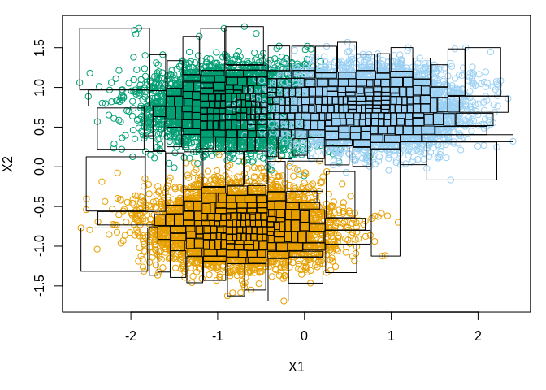

Next, we compute the run-times for the previous examples and compare the approximations of the un-normalized log weights, , and normalized weights, . The `n_threads` sets the number of threads to use in the methods.

``` r
# run-times
microbenchmark::microbenchmark(
  `dual tree 1` = mssm:::FSKA (X = X, ws = ws, Y = X, N_min = 10L, 
                               eps = 5e-3, n_threads = 1L),
  `dual tree 4` = mssm:::FSKA (X = X, ws = ws, Y = X, N_min = 10L, 
                               eps = 5e-3, n_threads = 4L),
  `naive 1`     = mssm:::naive(X = X, ws = ws, Y = X, n_threads = 1L),
  `naive 4`     = mssm:::naive(X = X, ws = ws, Y = X, n_threads = 4L),
  times = 10L)
```

    ## Unit: milliseconds
    ##         expr     min      lq    mean  median      uq     max neval
    ##  dual tree 1  110.13  112.64  166.98  116.79  241.55  330.79    10
    ##  dual tree 4   41.16   41.33   49.36   50.73   53.68   63.35    10
    ##      naive 1 3312.61 3342.68 3638.94 3434.74 3547.45 5565.56    10
    ##      naive 4  909.17 1018.03 1113.10 1079.78 1129.06 1592.45    10

``` r
# The functions return the un-normalized log weights. We first compare
# the result on this scale
o1 <- mssm:::FSKA  (X = X, ws = ws, Y = X, N_min = 10L, eps = 5e-3, 
                    n_threads = 1L)
o2 <- mssm:::naive(X = X, ws = ws, Y = X, n_threads = 4L)

all.equal(o1, o2)
```

    ## [1] "Mean relative difference: 0.0015"

``` r
par(mar = c(5, 4, 1, 1))
hist((o1 - o2)/ abs((o1 + o2) / 2), breaks = 50, main = "", 
     xlab = "Delta un-normalized log weights")
```

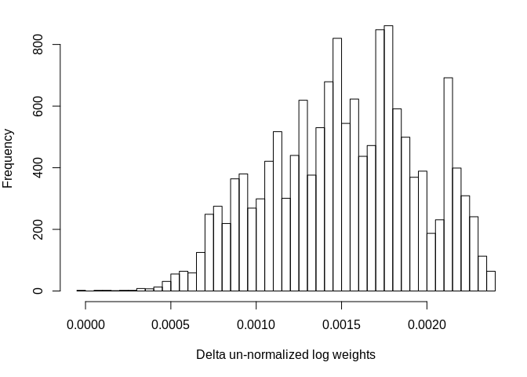

``` r
# then we compare the normalized weights
func <- function(x){
  x_max <- max(x)
  x <- exp(x - x_max)
  x / sum(x)
}

o1 <- func(o1)
o2 <- func(o2)
all.equal(o1, o2)
```

    ## [1] "Mean relative difference: 0.0008531"

``` r
hist((o1 - o2)/ abs((o1 + o2) / 2), breaks = 50, main = "", 
     xlab = "Delta normalized log weights")
```

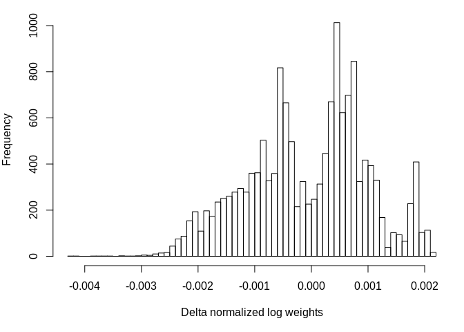

Finally, we compare the run-times as function of . The dashed line is "naive" method, the continuous line is the dual-tree method, and the dotted line is dual-tree method using 1 thread.

``` r
Ns <- 2^(7:14)
run_times <- lapply(Ns, function(N){ 
  invisible(list2env(get_sims(N), environment()))
  microbenchmark::microbenchmark(
    `dual-tree`   = mssm:::FSKA (X = X, ws = ws, Y = X, N_min = 10L, eps = 5e-3, 
                                 n_threads = 4L),
    naive         = mssm:::naive(X = X, ws = ws, Y = X, n_threads = 4L),
    `dual-tree 1` = mssm:::FSKA (X = X, ws = ws, Y = X, N_min = 10L, eps = 5e-3, 
                                 n_threads = 1L), 
    times = 5L)
}) 

Ns_xtra <- 2^(15:19) 
run_times_xtra <- lapply(Ns_xtra, function(N){
  invisible(list2env(get_sims(N), environment()))
  microbenchmark::microbenchmark(
    `dual-tree` = mssm:::FSKA (X = X, ws = ws, Y = X, N_min = 10L, eps = 5e-3, 
                               n_threads = 4L),
    times = 5L)
}) 
```

``` r
library(microbenchmark)
meds <- t(sapply(run_times, function(x) summary(x, unit = "s")[, "median"]))
meds_xtra <- 
  sapply(run_times_xtra, function(x) summary(x, unit = "s")[, "median"])
meds <- rbind(meds, cbind(meds_xtra, NA_real_, NA_real_))
dimnames(meds) <- list(
  N = c(Ns, Ns_xtra) * 3L, method = c("Dual-tree", "Naive", "Dual-tree 1"))
meds
```

    ##          method
    ## N         Dual-tree     Naive Dual-tree 1
    ##   384      0.001656  0.001729    0.003219
    ##   768      0.002904  0.004090    0.006349
    ##   1536     0.005031  0.009342    0.011293
    ##   3072     0.009151  0.037434    0.022862
    ##   6144     0.019268  0.150112    0.047924
    ##   12288    0.037420  0.635375    0.094008
    ##   24576    0.063480  2.676045    0.175921
    ##   49152    0.120780 10.544569    0.335214
    ##   98304    0.224966        NA          NA
    ##   196608   0.463704        NA          NA
    ##   393216   0.887116        NA          NA
    ##   786432   1.870536        NA          NA
    ##   1572864  3.845212        NA          NA

``` r
par(mar = c(5, 4, 1, 1))
matplot(c(Ns, Ns_xtra) * 3L, meds, lty = 1:3, type = "l", log = "xy", 
        ylab = "seconds", xlab = "N", col = "black")
```


Function Definitions
--------------------

``` r
# Stochastic gradient descent for mssm object. The function assumes that the 
# state vector is stationary. The default values are rather arbitrary.
# 
# Args:
#   object: an object of class mssmFunc. 
#   n_it: number of iterations. 
#   lrs: learning rates to use. Must have n_it elements. Like problem specific. 
#   avg_start: index to start averaging. See Polyak et al. (1992) for arguments
#              for averaging.
#   cfix: starting values for fixed coefficients. 
#   F.: starting value for transition matrix in conditional distribution of the 
#       current state given the previous state.
#   Q: starting value for covariance matrix in conditional distribution of the 
#      current state given the previous. 
#   verbose: TRUE if output should be printed during estmation. 
#   disp: starting value for dispersion parameter.
# 
# Returns:
#   List with estimates and the log-likelihood approximation at each iteration. 
sgd <- function(
  object, n_it = 150L, 
  lrs = 1e-2 * (1:n_it)^(-1/2), avg_start = max(1L, as.integer(n_it * 4L / 5L)),
  cfix, F., Q,  verbose = FALSE, disp = numeric())
{
  # make checks
  stopifnot(
    inherits(object, "mssmFunc"), object$control$what == "gradient", n_it > 0L, 
    all(lrs > 0.), avg_start > 1L, length(lrs) == n_it)
  n_fix <- nrow(object$X)
  n_rng <- nrow(object$Z)
  
  # objects for estimates at each iteration, gradient norms, and
  # log-likelihood approximations
  has_dispersion <-
    any(sapply(c("^Gamma", "^gaussian"), grepl, x = object$family))
  n_params <-
    has_dispersion + n_fix + n_rng * n_rng + n_rng * (n_rng  + 1L) / 2L
  ests <- matrix(NA_real_, n_it + 1L, n_params)
  ests[1L, ] <- c(
    cfix,  if(has_dispersion) disp else NULL, F.,
    Q[lower.tri(Q, diag = TRUE)])
  grad_norm <- lls <- rep(NA_real_, n_it)
  
  # indices of the different components
  idx_fix   <- 1:n_fix
  if(has_dispersion)
    idx_dip <- n_fix + 1L
  idx_F     <- 1:(n_rng * n_rng) + n_fix + has_dispersion
  idx_Q     <- 1:(n_rng * (n_rng  + 1L) / 2L) + n_fix + n_rng * n_rng +
    has_dispersion
  
  # function to set the parameters
  library(matrixcalc) # TODO: get rid of this
  dup_mat <- duplication.matrix(ncol(Q))
  set_parems <- function(i){
    # select whether or not to average
    idx <- if(i > avg_start) avg_start:i else i
    
    # set new parameters
    cfix   <<-             colMeans(ests[idx, idx_fix, drop = FALSE])
    if(has_dispersion)
      disp <<-             colMeans(ests[idx, idx_dip, drop = FALSE])
    F.[]   <<-             colMeans(ests[idx, idx_F  , drop = FALSE])
    Q[]    <<- dup_mat %*% colMeans(ests[idx, idx_Q  , drop = FALSE])
    
  }
    
  # run algorithm
  max_half <- 25L
  for(i in 1:n_it + 1L){
    # get gradient. First, run the particle filter
    filter_out <- object$pf_filter(
      cfix = cfix, disp = disp, F. = F., Q = Q, seed = NULL)
    lls[i - 1L] <- c(logLik(filter_out))
    
    # then get the gradient associated with each particle and the log 
    # normalized weight of the particles
    grads <- tail(filter_out$pf_output, 1L)[[1L]]$stats
    ws    <- tail(filter_out$pf_output, 1L)[[1L]]$ws_normalized
    
    # compute the gradient and take a small step
    grad <- colSums(t(grads) * drop(exp(ws)))
    grad_norm[i - 1L] <- norm(t(grad))
    
    lr_i <- lrs[i - 1L]
    k <- 0L
    while(k < max_half){
      ests[i, ] <- ests[i - 1L, ] + lr_i * grad 
      set_parems(i)
      
      # check that Q is positive definite and the system is stationary
      c1 <- all(abs(eigen(F.)$values) < 1)
      c2 <- all(eigen(Q)$values > 0)
      c3 <- !has_dispersion || disp > 0.
      if(c1 && c2 && c3)
        break
      
      # decrease learning rate
      lr_i <- lr_i * .5
      k <- k + 1L
    }
    
    # check if we failed to find a value within our constraints
    if(k == max_half)
      stop("failed to find solution within constraints")
    
    # print information if requested 
    if(verbose){
      cat(sprintf(
        "\nIt %5d: log-likelihood (current, max) %12.2f, %12.2f\n",
        i - 1L, logLik(filter_out), max(lls, na.rm = TRUE)),
        rep("-", 66), "\n", sep = "")
      cat("cfix\n")
      print(cfix)
      if(has_dispersion)
        cat(sprintf("Dispersion: %20.8f\n", disp))
      cat("F\n")
      print(F.)
      cat("Q\n")
      print(Q)
      cat(sprintf("Gradient norm: %10.4f\n", grad_norm[i - 1L]))
      print(get_ess(filter_out))

    }
  } 
  
  list(estimates = ests, logLik = lls, F. = F., Q = Q, cfix = cfix, 
       disp = disp, grad_norm = grad_norm)
}

# Stochastic gradient descent for mssm object using the Adam algorithm. The  
# function assumes that the state vector is stationary.
# 
# Args:
#   object: an object of class mssmFunc. 
#   n_it: number of iterations. 
#   mp: decay rate for first moment.
#   vp: decay rate for secod moment.
#   lr: learning rate.
#   cfix: starting values for fixed coefficients. 
#   F.: starting value for transition matrix in conditional distribution of the 
#       current state given the previous state.
#   Q: starting value for covariance matrix in conditional distribution of the 
#      current state given the previous. 
#   verbose: TRUE if output should be printed during estmation. 
#   disp: starting value for dispersion parameter.
# 
# Returns:
#   List with estimates and the log-likelihood approximation at each iteration. 
adam <- function(
  object, n_it = 150L, mp = .9, vp = .999, lr = .01, cfix, F., Q,
  verbose = FALSE, disp = numeric())
{
  # make checks
  stopifnot(
    inherits(object, "mssmFunc"), object$control$what == "gradient", n_it > 0L,
    lr > 0., mp > 0, mp < 1, vp > 0, vp < 1)
  n_fix <- nrow(object$X)
  n_rng <- nrow(object$Z)

  # objects for estimates at each iteration, gradient norms, and
  # log-likelihood approximations
  has_dispersion <-
    any(sapply(c("^Gamma", "^gaussian"), grepl, x = object$family))
  n_params <-
    has_dispersion + n_fix + n_rng * n_rng + n_rng * (n_rng  + 1L) / 2L
  ests <- matrix(NA_real_, n_it + 1L, n_params)
  ests[1L, ] <- c(
    cfix,  if(has_dispersion) disp else NULL, F.,
    Q[lower.tri(Q, diag = TRUE)])
  grad_norm <- lls <- rep(NA_real_, n_it)

  # indices of the different components
  idx_fix   <- 1:n_fix
  if(has_dispersion)
    idx_dip <- n_fix + 1L
  idx_F     <- 1:(n_rng * n_rng) + n_fix + has_dispersion
  idx_Q     <- 1:(n_rng * (n_rng  + 1L) / 2L) + n_fix + n_rng * n_rng +
    has_dispersion

  # function to set the parameters
  library(matrixcalc) # TODO: get rid of this
  dup_mat <- duplication.matrix(ncol(Q))
  set_parems <- function(i){
    cfix   <<-             ests[i, idx_fix]
    if(has_dispersion)
      disp <<-             ests[i, idx_dip]
    F.[]   <<-             ests[i, idx_F  ]
    Q[]    <<- dup_mat %*% ests[i, idx_Q  ]

  }

  # run algorithm
  max_half <- 25L
  m <- NULL
  v <- NULL
  failed <- FALSE
  for(i in 1:n_it + 1L){
    # get gradient. First, run the particle filter
    filter_out <- object$pf_filter(
      cfix = cfix, disp = disp, F. = F., Q = Q, seed = NULL)
    lls[i - 1L] <- c(logLik(filter_out))

    # then get the gradient associated with each particle and the log
    # normalized weight of the particles
    grads <- tail(filter_out$pf_output, 1L)[[1L]]$stats
    ws    <- tail(filter_out$pf_output, 1L)[[1L]]$ws_normalized

    # compute the gradient and take a small step
    grad <- colSums(t(grads) * drop(exp(ws)))
    grad_norm[i - 1L] <- norm(t(grad))

    m <- if(is.null(m)) (1 - mp) * grad   else mp * m + (1 - mp) * grad
    v <- if(is.null(v)) (1 - vp) * grad^2 else vp * v + (1 - vp) * grad^2
    mh <- m / (1 - mp^(i - 1))
    vh <- v / (1 - vp^(i - 1))
    de <- mh / sqrt(vh + 1e-8)

    lr_i <- lr
    k <- 0L
    while(k < max_half){
      ests[i, ] <- ests[i - 1L, ] + lr_i * de
      set_parems(i)

      # check that Q is positive definite, the dispersion parameter is
      # positive, and the system is stationary
      c1 <- all(abs(eigen(F.)$values) < 1)
      c2 <- all(eigen(Q)$values > 0)
      c3 <- !has_dispersion || disp > 0.
      if(c1 && c2 && c3)
        break

      # decrease learning rate
      lr_i <- lr_i * .5
      k <- k + 1L
    }

    # check if we failed to find a value within our constraints
    if(k == max_half){
      warning("failed to find solution within constraints")
      failed <- TRUE
      break
    }

    # print information if requested
    if(verbose){
      cat(sprintf(
        "\nIt %5d: log-likelihood (current, max) %12.2f, %12.2f\n",
        i - 1L, logLik(filter_out), max(lls, na.rm = TRUE)),
        rep("-", 66), "\n", sep = "")
      cat("cfix\n")
      print(cfix)
      if(has_dispersion)
        cat(sprintf("Dispersion: %20.8f\n", disp))
      cat("F\n")
      print(F.)
      cat("Q\n")
      print(Q)
      cat(sprintf("Gradient norm: %10.4f\n", grad_norm[i - 1L]))
      print(get_ess(filter_out))

    }
  }

  list(estimates = ests, logLik = lls, F. = F., Q = Q, cfix = cfix, 
       disp = disp, failed = failed, grad_norm = grad_norm)
}
```

References
----------

Gray, Alexander G., and Andrew W. Moore. 2003. “Rapid Evaluation of Multiple Density Models.” In *AISTATS*.

Klaas, Mike, Mark Briers, Nando de Freitas, Arnaud Doucet, Simon Maskell, and Dustin Lang. 2006. “Fast Particle Smoothing: If I Had a Million Particles.” In *Proceedings of the 23rd International Conference on Machine Learning*, 481–88. ICML ’06. New York, NY, USA: ACM. <https://doi.acm.org/10.1145/1143844.1143905>.

Lin, Ming T, Junni L Zhang, Qiansheng Cheng, and Rong Chen. 2005. “Independent Particle Filters.” *Journal of the American Statistical Association* 100 (472). Taylor & Francis: 1412–21. <https://doi.org/10.1198/016214505000000349>.

Polyak, B., and A. Juditsky. 1992. “Acceleration of Stochastic Approximation by Averaging.” *SIAM Journal on Control and Optimization* 30 (4): 838–55. <https://doi.org/10.1137/0330046>.

Poyiadjis, George, Arnaud Doucet, and Sumeetpal S. Singh. 2011. “Particle Approximations of the Score and Observed Information Matrix in State Space Models with Application to Parameter Estimation.” *Biometrika* 98 (1). Biometrika Trust: 65–80. <https://www.jstor.org/stable/29777165>.
